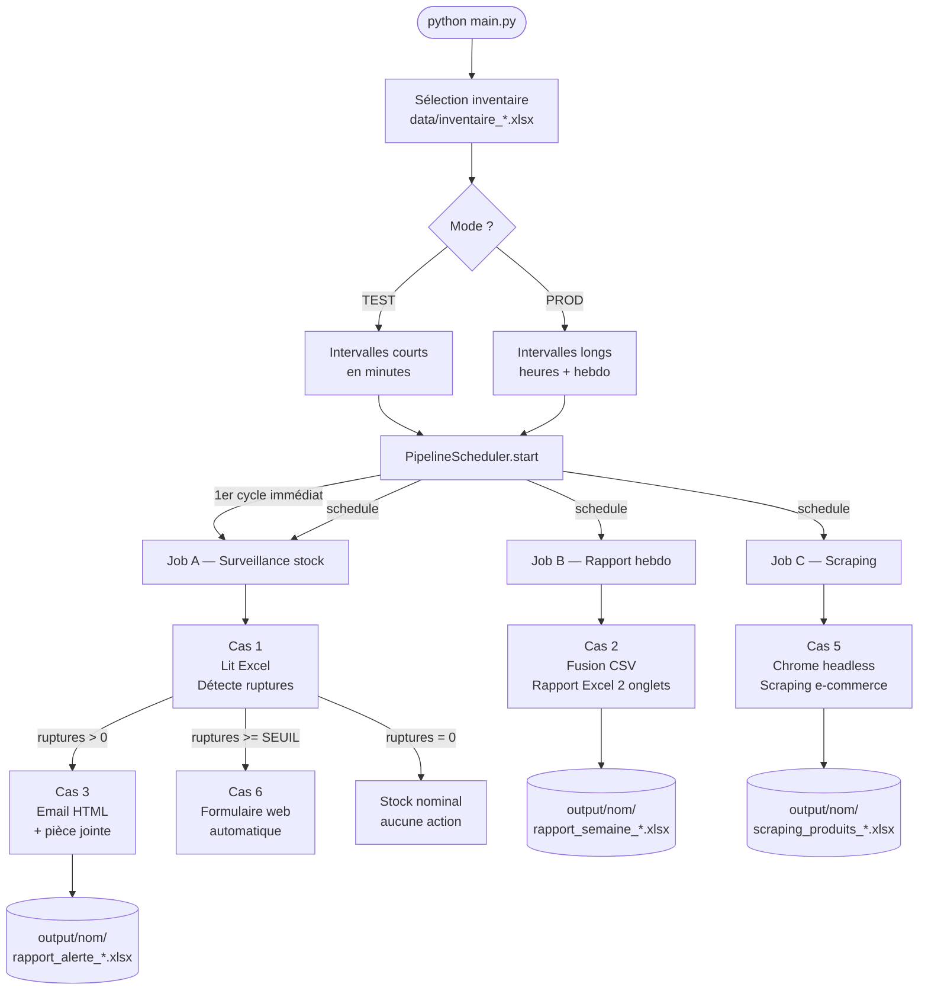
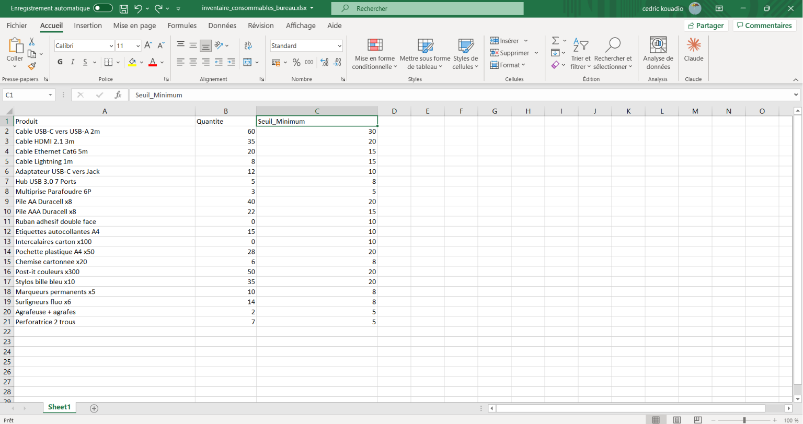
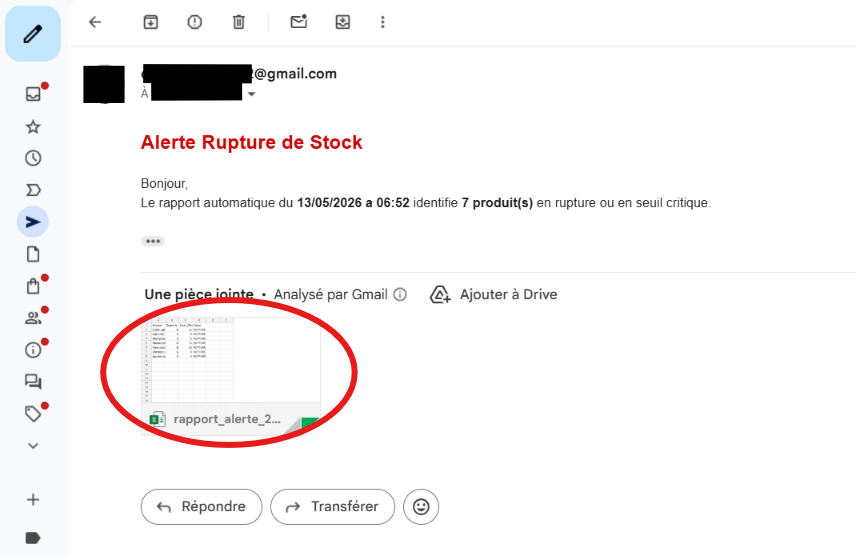

# Automatisation Python — Pipeline d'entreprise


[](https://codespaces.new/GomuGomuNo01/automatisation-de-processus)

---

## Table des matières

- [Explication](#explication)
- [Architecture technique](#architecture-technique)
- [Structure des fichiers de données](#structure-des-fichiers-de-données)
- [Flux de traitement détaillé](#flux-de-traitement-détaillé)
- [Structure du projet](#structure-du-projet)
- [Installation](#installation)
- [Configuration `.env`](#configuration-env)
- [Utilisation](#utilisation)
- [Modes TEST et PRODUCTION](#modes-test-et-production)
- [6 cas d'automatisation](#6-cas-dautomatisation)
- [Cas d'usage métier](#cas-dusage-métier)
- [Tester depuis GitHub Codespaces](#tester-depuis-github-codespaces)
- [Technologies](#technologies)
- [Auteur](#auteur)

---

## Explication

> Pour quelqu'un qui ne connaît pas la programmation.

Imaginez une entreprise qui gère des stocks de produits. Chaque jour, quelqu'un doit :

- Vérifier si des produits manquent (rupture de stock)
- Envoyer un email d'alerte si c'est le cas
- Générer un rapport de la semaine
- Surveiller les prix des concurrents en ligne

Normalement, tout ça se fait à la main. Ce projet le fait **automatiquement**, sans qu'on ait à intervenir.

**Ce que vous faites vous-même :** choisir quel fichier de stock surveiller, et dire si c'est un test ou la vraie utilisation.

**Ce que le programme fait tout seul, en boucle :**

1. Il lit le fichier Excel de stock
2. Il repère les produits dont la quantité est trop basse
3. S'il y en a, il envoie automatiquement un email d'alerte
4. Si c'est grave (trop de ruptures), il remplit aussi un formulaire d'urgence
5. Chaque semaine, il génère un rapport de production complet
6. Régulièrement, il scrape les prix des concurrents sur internet

---

## Architecture technique

### Vue d'ensemble

```
python main.py
    │
    ├── 1. Scan data/inventaire_*.xlsx  ──►  sélection utilisateur
    ├── 2. Choix du mode TEST / PROD    ──►  intervalles courts ou longs
    │
    └── PipelineScheduler
            │
            ├─ [job A] ─ toutes les X min/h ──► _pipeline_surveillance()
            │                                        │
            │                                        ├── Cas 1 : détection ruptures
            │                                        ├── si ruptures > 0  ──► Cas 3 : email
            │                                        └── si ruptures >= seuil ──► Cas 6 : formulaire
            │
            ├─ [job B] ─ hebdo / toutes les Y min ──► Cas 2 : rapport production
            │
            └─ [job C] ─ toutes les Z min/h ──► Cas 5 : scraping produits
```

### Diagramme de flux complet



### Flux de configuration

```
.env  (source unique de vérité)
 └── config.py
       ├── _require(key)          ──►  lève RuntimeError si variable absente
       ├── get_output_dir(inv)    ──►  output/<nom>/
       ├── get_production_dir(inv)──►  data/production/<nom>/
       └── get_scraping_url(inv)  ──►  URL ciblée pour cet inventaire

       scheduler.py  ──► charge les scripts via importlib (chemin absolu)
       scripts/*.py  ──► importent config via scripts/config.py (redirecteur)
```

---

## Structure des fichiers de données

### Fichier inventaire (`data/inventaire_*.xlsx`)

Chaque fichier inventaire contient 3 colonnes obligatoires :



```
┌──────────────────────────────────────┬──────────┬───────────────┐
│ Produit                              │ Quantite │ Seuil_Minimum │
├──────────────────────────────────────┼──────────┼───────────────┤
│ Cable USB-C vers USB-A 2m            │       60 │            30 │
│ Cable HDMI 2.1 3m                    │       35 │            20 │
│ Cable Ethernet Cat6 5m               │       20 │            15 │
│ Hub USB 3.0 7 Ports                  │        5 │             8 │  ← RUPTURE
│ Multiprise Parafoudre 6P             │        3 │             5 │  ← RUPTURE
│ Ruban adhesif double face            │        0 │            10 │  ← RUPTURE
│ Intercalaires carton x100            │        0 │            10 │  ← RUPTURE
│ Agrafeuse + agrafes                  │        2 │             5 │  ← RUPTURE
└──────────────────────────────────────┴──────────┴───────────────┘
```

> **Règle de détection :** `Quantite <= Seuil_Minimum` → produit marqué `RUPTURE`

Les 3 fichiers disponibles et leur domaine :

| Fichier                               | Domaine                | URL scraping associée |
|---------------------------------------|------------------------|-----------------------|
| `inventaire_gaming_multimedia.xlsx`   | Gaming & périphériques | Téléphones            |
| `inventaire_consommables_bureau.xlsx` | Fournitures bureau     | Tablettes             |
| `inventaire_stockage_securite.xlsx`   | Stockage & sécurité    | Ordinateurs           |

### Fichiers de production (`data/production/<nom>/*.csv`)

Un fichier CSV par jour de la semaine, par inventaire :

```
data/production/
├── consommables_bureau/
│   ├── Lundi.csv
│   ├── Mardi.csv
│   ├── Mercredi.csv
│   ├── Jeudi.csv
│   └── Vendredi.csv
├── gaming_multimedia/   (même structure)
└── stockage_securite/   (même structure)
```

Contenu d'un fichier CSV journalier :

```csv
Produit,Quantite_Produite,Ligne_Production
Stylos,1200,B1
Ramettes A4,350,B2
Post-it,800,B3
Cartouches Imprimante,90,B4
Classeurs,240,B5
```

| Colonne             | Description                          |
|---------------------|--------------------------------------|
| `Produit`           | Nom du produit fabriqué              |
| `Quantite_Produite` | Nombre d'unités produites ce jour    |
| `Ligne_Production`  | Identifiant de la ligne d'assemblage |

### Fichiers générés (`output/<nom>/`)

```
output/
└── consommables_bureau/
    ├── rapport_alerte_2026-05-13_06-52.xlsx   ← Cas 1 & 3
    ├── rapport_semaine_2026-05-13_09-00.xlsx  ← Cas 2
    └── scraping_produits_2026-05-13_12-00.xlsx ← Cas 5
```

**Rapport d'alerte** (`rapport_alerte_*.xlsx`) — produit par Cas 1 :

```
┌──────────────────────────────────┬──────────┬───────────────┬─────────┐
│ Produit                          │ Quantite │ Seuil_Minimum │ Statut  │
├──────────────────────────────────┼──────────┼───────────────┼─────────┤
│ Hub USB 3.0 7 Ports              │        5 │             8 │ RUPTURE │
│ Multiprise Parafoudre 6P         │        3 │             5 │ RUPTURE │
│ Ruban adhesif double face        │        0 │            10 │ RUPTURE │
│ Agrafeuse + agrafes              │        2 │             5 │ RUPTURE │
└──────────────────────────────────┴──────────┴───────────────┴─────────┘
```

**Rapport hebdomadaire** (`rapport_semaine_*.xlsx`) — produit par Cas 2, 2 onglets :

```
Onglet 1 — Détail journalier
┌──────────┬──────────────────┬────────────────────┬──────────────────┐
│ Jour     │ Produit          │ Quantite_Produite  │ Ligne_Production │
├──────────┼──────────────────┼────────────────────┼──────────────────┤
│ Lundi    │ Stylos           │               1200 │ B1               │
│ Lundi    │ Ramettes A4      │                350 │ B2               │
│ Mardi    │ Stylos           │               1050 │ B1               │
│ ...      │ ...              │                ... │ ...              │
└──────────┴──────────────────┴────────────────────┴──────────────────┘

Onglet 2 — Récapitulatif semaine
┌──────────────────┬────────────────┐
│ Produit          │ Total_Semaine  │
├──────────────────┼────────────────┤
│ Stylos           │           5730 │
│ Post-it          │           3950 │
│ Ramettes A4      │           1860 │
│ ...              │            ... │
└──────────────────┴────────────────┘
```

---

## Flux de traitement détaillé

### Cas 1 — Rapport de stock

```
inventaire_*.xlsx
        │
        ▼
  pandas.read_excel()
        │
        ▼
  df[df["Quantite"] <= df["Seuil_Minimum"]]
        │
        ├── Résultat vide  ──► "Stock nominal" — aucun fichier généré
        │
        └── Ruptures trouvées
                │
                ▼
        alertes["Statut"] = "RUPTURE"
                │
                ▼
        output/<nom>/rapport_alerte_YYYY-MM-DD_HH-MM.xlsx
                │
                ▼
        return len(alertes)  ──► transmis au pipeline pour décision
```

### Cas 2 — Rapport hebdomadaire

```
data/production/<nom>/
    Lundi.csv + Mardi.csv + Mercredi.csv + Jeudi.csv + Vendredi.csv
        │
        ▼
  pandas.read_csv() × 5  +  ajout colonne "Jour"
        │
        ▼
  pandas.concat()  ──► DataFrame unique (toute la semaine)
        │
        ├── Onglet 1 : toutes les lignes avec colonne Jour
        │
        └── Onglet 2 : groupby("Produit").sum("Quantite_Produite")
                │
                ▼
        output/<nom>/rapport_semaine_YYYY-MM-DD_HH-MM.xlsx
```

### Cas 3 — Alerte email

```
inventaire_*.xlsx
        │
        ▼
  Même logique que Cas 1 (détection ruptures)
        │
        ▼
  Construction email HTML
  ┌─────────────────────────────────────────────────┐
  │  Objet : [ALERTE STOCK] 7 produit(s) en rupture │
  │  Corps  : tableau HTML coloré (rouge = rupture)  │
  │  PJ     : rapport_alerte_*.xlsx (Base64)         │
  └─────────────────────────────────────────────────┘
        │
        ▼
  smtplib.SMTP_SSL("smtp.gmail.com", 465)
  srv.login(EMAIL_EXPEDITEUR, MOT_DE_PASSE_APP)
  srv.sendmail(...)
        │
        ▼
  Email recu dans la boite du destinataire
```

> Le destinataire reçoit un email avec le tableau des ruptures et le fichier Excel en pièce jointe.



### Cas 5 — Scraping produits

```
config.get_scraping_url(inventaire)
        │  ex: https://webscraper.io/.../computers/tablets
        ▼
  Chrome headless (Selenium Manager gère ChromeDriver)
        │
        ▼
  WebDriverWait → présence de .thumbnail
        │
        ▼
  Pour chaque produit :
    .title        ──► nom du produit
    .price        ──► prix affiché
    .description  ──► description courte
    .glyphicon-star × N ──► note /5
        │
        ▼
  pandas.DataFrame → output/<nom>/scraping_produits_YYYY-MM-DD_HH-MM.xlsx
```

### Cas 6 — Formulaire automatique

```
config.FORMULAIRE_URL
        │
        ▼
  Chrome headless/visible
        │
        ▼
  WebDriverWait → présence du champ "my-text"
        │
        ▼
  Séquence de saisie :
    find_element(NAME, "my-text")     .send_keys(FORM_TEXTE)
    find_element(NAME, "my-password") .send_keys(FORM_PASSWORD)
    find_element(NAME, "my-textarea") .send_keys(FORM_TEXTAREA)
    Select(my-select).select_by_visible_text(FORM_SELECT)
        │
        ▼
  button[type='submit'].click()
        │
        ▼
  Confirmation : URL après soumission loguée en console
```

### Pipeline complet — enchaînement automatique

```
Cycle de surveillance (toutes les X min/h)
═══════════════════════════════════════════════════════

  [HH:MM:SS] Pipeline surveillance — inventaire_*.xlsx

  ÉTAPE 1 — Lecture + détection (Cas 1)
  ┌────────────────────────────────────────────────┐
  │  20 produits analysés                          │
  │   7 produits en RUPTURE  (Quantite <= Seuil)   │
  └────────────────────────────────────────────────┘
          │
          │  ruptures = 7 > 0
          ▼
  ÉTAPE 2 — Alerte email (Cas 3)
  ┌────────────────────────────────────────────────┐
  │  Email envoyé à : destinataire@entreprise.com  │
  │  PJ : rapport_alerte_2026-05-13_06-52.xlsx     │
  └────────────────────────────────────────────────┘
          │
          │  ruptures = 7 >= SEUIL (3)
          ▼
  ÉTAPE 3 — Formulaire d'urgence (Cas 6)
  ┌────────────────────────────────────────────────┐
  │  Chrome headless → formulaire rempli + soumis  │
  └────────────────────────────────────────────────┘

  Prochain cycle : HH:MM:SS
```

---

## Structure du projet

```
automatisation-delifruits/
│
├── main.py                          # Point d'entrée — 2 questions, tout le reste auto
├── scheduler.py                     # PipelineScheduler — orchestre les 3 jobs
├── config.py                        # Configuration centrale (lit .env via _require)
├── .env                             # Credentials locaux (gitignore)
├── .env.example                     # Template — à copier en .env
├── requirements.txt
├── README.md
│
├── scripts/
│   ├── config.py                    # Redirecteur importlib → config.py racine
│   ├── cas1_stock.py                # Détection ruptures → rapport Excel
│   ├── cas2_fusion.py               # Fusion CSV → rapport hebdomadaire 2 onglets
│   ├── cas3_email.py                # Email HTML + pièce jointe via Gmail SMTP SSL
│   ├── cas4_planifie.py             # Boucle schedule standalone (usage direct)
│   ├── cas5_scraping.py             # Chrome headless → scraping → Excel
│   └── cas6_formulaire.py           # Chrome → saisie automatique formulaire web
│
├── data/
│   ├── inventaire_gaming_multimedia.xlsx
│   ├── inventaire_consommables_bureau.xlsx
│   ├── inventaire_stockage_securite.xlsx
│   └── production/
│       ├── gaming_multimedia/       # Lundi.csv → Vendredi.csv (gaming)
│       ├── consommables_bureau/     # Lundi.csv → Vendredi.csv (bureau)
│       └── stockage_securite/       # Lundi.csv → Vendredi.csv (stockage)
│
└── output/                          # Généré automatiquement — gitignore
    ├── gaming_multimedia/
    ├── consommables_bureau/
    └── stockage_securite/
```

---

## Installation

### Prérequis

- Python 3.10+
- Google Chrome installé (pour Selenium — Cas 5 & 6)

### Étapes

```bash
# 1. Cloner le dépôt
git clone https://github.com/GomuGomuNo01/automatisation-de-processus.git
cd automatisation-de-processus

# 2. Créer un environnement virtuel
python -m venv .venv
source .venv/bin/activate      # Linux/macOS
.venv\Scripts\activate         # Windows

# 3. Installer les dépendances
pip install -r requirements.txt

# 4. Configurer les variables d'environnement
cp .env.example .env
# puis éditez .env avec vos valeurs
```

---

## Configuration `.env`

Le fichier `.env` est la **source unique de vérité**. `config.py` utilise `_require(key)` — si une variable est absente, le programme lève une `RuntimeError` explicite plutôt que de planter silencieusement.

```ini
# ── Email ──────────────────────────────────────────────────────────────────────
EMAIL_EXPEDITEUR=votre.adresse@gmail.com
MOT_DE_PASSE_APP=xxxx xxxx xxxx xxxx
EMAIL_DESTINATAIRE=responsable@entreprise.com

# ── Intervalles TEST (en minutes) ──────────────────────────────────────────────
TEST_INTERVALLE_STOCK_MINUTES=1
TEST_INTERVALLE_RAPPORT_MINUTES=2
TEST_INTERVALLE_SCRAPING_MINUTES=3

# ── Intervalles PRODUCTION ─────────────────────────────────────────────────────
PROD_INTERVALLE_STOCK_MINUTES=60
PROD_INTERVALLE_SCRAPING_HEURES=4
PROD_JOUR_RAPPORT_HEBDO=friday

# ── Pipeline ───────────────────────────────────────────────────────────────────
SEUIL_DECLENCHEMENT_FORMULAIRE=3

# ── Scraping — une URL par inventaire ──────────────────────────────────────────
SCRAPING_URL_GAMING_MULTIMEDIA=https://webscraper.io/.../phones/touch
SCRAPING_URL_CONSOMMABLES_BUREAU=https://webscraper.io/.../computers/tablets
SCRAPING_URL_STOCKAGE_SECURITE=https://webscraper.io/.../computers

# ── Formulaire ─────────────────────────────────────────────────────────────────
FORMULAIRE_URL=https://www.selenium.dev/selenium/web/web-form.html
FORM_TEXTE=Votre Nom
FORM_PASSWORD=MotDePasse123
FORM_TEXTAREA=Saisie automatique via Selenium.
FORM_SELECT=Two
```

### Générer un mot de passe d'application Gmail

1. Compte Google → Sécurité → Validation en 2 étapes (activer)
2. Sécurité → Mots de passe des applications
3. Générer → copier le code à 16 caractères dans `MOT_DE_PASSE_APP`

---

## Utilisation

```bash
python main.py
```

Deux questions, puis tout est automatique :

```
============================================================
  Systeme d'automatisation Python
============================================================

  Fichiers inventaire disponibles
------------------------------------------------------------
  1. inventaire_consommables_bureau.xlsx
  2. inventaire_gaming_multimedia.xlsx
  3. inventaire_stockage_securite.xlsx
------------------------------------------------------------
  Selectionnez un fichier (1-3) : 1

============================================================
  Mode d'execution
------------------------------------------------------------
  1. TEST       — intervalles courts (minutes)
  2. PRODUCTION — intervalles reels  (heures/semaine)
------------------------------------------------------------
  Selectionnez un mode (1 ou 2) : 1

============================================================
  Pipeline d'automatisation
  Inventaire : inventaire_consommables_bureau.xlsx
  Sortie     : output/consommables_bureau/
  Production : data/production/consommables_bureau/
============================================================
  Mode TEST actif :
    Surveillance stock  : toutes les 1 minute(s)
    Rapport production  : toutes les 2 minute(s)
    Scraping produits   : toutes les 3 minute(s)
  Arret : Ctrl+C
============================================================
```

### Scripts standalone

Chaque script peut aussi être lancé directement (utile pour tester un cas isolé) :

```bash
python scripts/cas1_stock.py     # → output/gaming_multimedia/rapport_alerte_*.xlsx
python scripts/cas2_fusion.py    # → output/gaming_multimedia/rapport_semaine_*.xlsx
python scripts/cas3_email.py     # → email envoyé + rapport en PJ
python scripts/cas5_scraping.py  # → output/gaming_multimedia/scraping_produits_*.xlsx
python scripts/cas6_formulaire.py
```

> En mode standalone, tous les scripts ciblent `inventaire_gaming_multimedia.xlsx` par défaut.

---

## Modes TEST et PRODUCTION

|                    | Mode TEST                                         | Mode PRODUCTION                                |
|--------------------|---------------------------------------------------|------------------------------------------------|
| Surveillance stock | toutes les `TEST_INTERVALLE_STOCK_MINUTES` min    | toutes les `PROD_INTERVALLE_STOCK_MINUTES` min |
| Rapport hebdo      | toutes les `TEST_INTERVALLE_RAPPORT_MINUTES` min  | chaque `PROD_JOUR_RAPPORT_HEBDO` à 08:00       |
| Scraping           | toutes les `TEST_INTERVALLE_SCRAPING_MINUTES` min | toutes les `PROD_INTERVALLE_SCRAPING_HEURES` h |
| Objectif           | Valider le pipeline en < 5 minutes                | Usage réel, surveillance continue              |

---

## 6 cas d'automatisation

| # | Nom                    | Technologie      | Ce que ça fait                                                                |
|---|------------------------|------------------|-------------------------------------------------------------------------------|
| 1 | Rapport de stock       | Pandas, OpenPyXL | Lit l'inventaire, détecte `Quantite <= Seuil_Minimum`, génère Excel horodaté  |
| 2 | Rapport hebdomadaire   | Pandas, OpenPyXL | Fusionne les 5 CSV journaliers en Excel 2 onglets (détail + récap)            |
| 3 | Alerte email           | smtplib, MIME    | Email HTML avec tableau ruptures + rapport Excel en PJ via Gmail SMTP SSL 465 |
| 4 | Surveillance planifiée | schedule         | Boucle autonome : exécute Cas 1 à intervalle fixe (mode standalone)           |
| 5 | Scraping produits      | Selenium, Chrome | Chrome headless → extraction prix/descriptions → export Excel par inventaire  |
| 6 | Formulaire automatique | Selenium, Chrome | Saisie champ par champ + soumission d'un formulaire web (alerte urgente)      |

---

## Cas d'usage métier

### Marie — Responsable logistique

> "Je dois surveiller 4 entrepôts différents. Avant, je vérifiais chaque fichier Excel manuellement le matin."

Marie lance `python main.py`, sélectionne l'inventaire de son entrepôt, choisit le mode PRODUCTION. Le système surveille le stock toutes les heures, lui envoie un email dès qu'un produit passe sous le seuil, et génère le rapport hebdomadaire automatiquement chaque vendredi matin à 08:00.

### Thomas — Acheteur

> "Je dois comparer nos prix avec ceux des concurrents chaque semaine."

Thomas configure la `SCRAPING_URL_*` correspondante. Le scraping tourne toutes les 4 heures en PROD et exporte les prix dans `output/<inventaire>/scraping_produits_*.xlsx`.

### Léa — Assistante administrative

> "Quand le stock de fournitures est critique, je dois remplir un formulaire de commande urgente."

Léa sélectionne `inventaire_consommables_bureau.xlsx`. Si le nombre de ruptures dépasse `SEUIL_DECLENCHEMENT_FORMULAIRE`, le formulaire est rempli et soumis automatiquement — sans qu'elle intervienne.

---

## Tester depuis GitHub Codespaces

**L'environnement se configure entièrement au premier lancement** — Python, dépendances, Chromium et le `.env` sont prêts sans aucune action manuelle.

[](https://codespaces.new/GomuGomuNo01/automatisation-de-processus)

> Au démarrage du Codespace, le script `.devcontainer/setup.sh` s'exécute automatiquement :
> installe Chromium, installe les dépendances pip, et copie `.env.example` → `.env`.

### Cas testables immédiatement (sans modifier `.env`)

```bash
python scripts/cas1_stock.py      # Rapport de stock     → output/*/rapport_alerte_*.xlsx
python scripts/cas2_fusion.py     # Rapport hebdomadaire → output/*/rapport_semaine_*.xlsx
python scripts/cas5_scraping.py   # Scraping produits    → output/*/scraping_produits_*.xlsx
python scripts/cas6_formulaire.py # Formulaire web automatique (headless)
```

### Cas 3 — Email (credentials Gmail requis)

Éditez le `.env` généré automatiquement et renseignez les 3 variables email :

```bash
# Dans le terminal Codespaces :
code .env   # ou nano .env

# Renseignez :
# EMAIL_EXPEDITEUR=votre.adresse@gmail.com
# MOT_DE_PASSE_APP=xxxx xxxx xxxx xxxx
# EMAIL_DESTINATAIRE=destinataire@exemple.com

python scripts/cas3_email.py
```

### Pipeline complet en mode TEST (résultats en ~3 minutes)

```bash
python main.py
# → Sélectionnez un inventaire
# → Choisissez le mode TEST
# → Observez les 3 jobs s'exécuter automatiquement
# → Ctrl+C pour arrêter
```

---

## Technologies

| Librairie       | Version | Rôle                                                    |
|-----------------|---------|---------------------------------------------------------|
| `pandas`        | >= 3.0  | Lecture Excel/CSV, filtrage, agrégation, export         |
| `openpyxl`      | >= 3.1  | Écriture Excel multi-onglets                            |
| `python-dotenv` | >= 1.0  | Chargement `.env` → variables Python                    |
| `schedule`      | >= 1.2  | Planification des tâches récurrentes                    |
| `selenium`      | >= 4.43 | Automatisation Chrome headless (scraping & formulaires) |

---

## Auteur

**Cedrick Kouadio**
[github.com/GomuGomuNo01](https://github.com/GomuGomuNo01)
